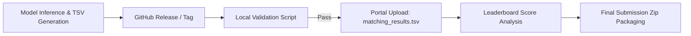

# Amazon ML Challenge 2026

Welcome to the Amazon ML Challenge 2026 repository.

---

## 📚 Official Challenge Documents

1. 📄 **[Problem Statement & Specifications](./README_PROBLEM_STATEMENT.md)** (`README_PROBLEM_STATEMENT.md`)
   * Business Entity Resolution Challenge overview
   * File formats & data descriptions (Source 1, 2, 3 TSVs, and Ground Truth)
   * Output format specifications (`matching_results.tsv`, `candidate_pairs.tsv`)
   * Submission package directory structure & rules
   * $F_{0.5}$ evaluation metric & examples
   * Leaderboard details & academic integrity / anti-cheating guidelines
   * Tips for success

2. 📋 **[Guidelines & Key Instructions](./README_GUIDELINES_AND_KEY_INSTRUCTIONS.md)** (`README_GUIDELINES_AND_KEY_INSTRUCTIONS.md`)
   * Challenge window (25th Sep 2026 12:00 AM IST to 27th Sep 2026 11:59 PM IST)
   * Submission limits (max 5 per day)
   * Artifacts & documentation requirements
   * Top 100 teams criteria & guidelines
   * Login rules, technical troubleshooting, and support contacts

3. 📖 **[How to Run Guide](./HOW_TO_RUN.md)** (`HOW_TO_RUN.md`)
   * PowerShell, CMD, and Bash execution commands for training, testing, validation, and packaging.


---

## 🚀 Team Leader Submission & Analysis Guide

This section defines the standard operating procedure for validating, publishing, submitting, and analyzing model outputs across the team.



### 1. GitHub Releases & Version Tracking Workflow
Since large TSV output files are excluded by [`.gitignore`](./.gitignore) to keep the repository clean, use **Git Tags and GitHub Releases** to hand off tested outputs to the team leader:

1. **Tag the code version:**
   ```bash
   git tag -a v1.0.0-baseline -m "Baseline LightGBM Model - CV F0.5: 0.812"
   git push origin v1.0.0-baseline
   ```
2. **Publish a GitHub Release:**
   * Go to **GitHub Repo $\rightarrow$ Releases $\rightarrow$ Draft a new release**.
   * Select tag (e.g. `v1.0.0-baseline`).
   * Include the local validation score, features used, and threshold in the release notes.
   * **Attach `matching_results.tsv` and `candidate_pairs.tsv` directly to the release assets.**
   * The team leader downloads the attached `matching_results.tsv` for submission.

---

### 2. Pre-Submission Local Validation Checklist
Before uploading any file to the portal, the team leader must run the local validator to avoid wasting any of the **5 daily submission attempts**:

```bash
python utils/validate_submission.py \
  --matching output/matching_results.tsv \
  --candidate output/candidate_pairs.tsv \
  --test-dir dataset/test
```

✅ **Verification Checks:**
* Exit status must be **`PASS (exit 0)`**.
* Every single $S_1$ entity in `dataset/test/test_source1.tsv` is present in `matching_results.tsv`.
* Singletons (entities with no matches) have an empty string.
* No duplicate entity IDs within any comma-separated list.
* Matched IDs strictly belong to Source 2 (`S2-*`) or Source 3 (`S3-*`).

---

### 3. Portal Submission Step-by-Step
1. Log in to the challenge portal on desktop/laptop (ensure no simultaneous logins).
2. Go to the **Submission** section.
3. Upload **`matching_results.tsv`** ONLY (tab-separated).
4. Verify the status updates to **`SCORED`**.
5. Record the **Public Leaderboard $F_{0.5}$ score** and timestamp in the team tracking log.

---

### 4. How to Analyze Scores & Rankings

| Scenario | Observation | Cause & Corrective Action |
| :--- | :--- | :--- |
| **Score Drops on Leaderboard** | $F_{0.5}$ drops significantly | **False Merges (Low Precision):** The model is being too aggressive. Because $F_{0.5}$ penalizes false positives $2\times$ more than false negatives, raise the matching confidence threshold or strengthen the singleton barrier. |
| **Score Improves Consistently** | $F_{0.5}$ improves in line with local CV | **High Precision + Good Blocking Recall:** The candidate generation captured true matches and the classifier rejected false pairs cleanly. |
| **High Local CV vs. Low Leaderboard** | Local CV is high, but Portal score is low | **Overfitting to Training Countries (US/India):** The test set includes unseen **France** data. Ensure features are language-agnostic and avoid hardcoding US/India dictionaries. |

---

### 5. Final Challenge Submission Package Assembly
At the end of the competition, prepare the final archive **`<team_name>_submission.zip`**:

```text
<team_name>_submission.zip
├── output/
│   ├── matching_results.tsv          # Final matches (best leaderboard submission)
│   └── candidate_pairs.tsv           # Candidate set fed to the final model
├── code/
│   └── business_entity_resolution/
│       ├── src/                      # All runnable pipeline source code
│       ├── README.md                 # End-to-end reproduction instructions
│       └── requirements.txt          # Pinned library dependencies
└── Documentation_template.md         # Filled 1–2 page methodology write-up
```

* Verify that anyone can re-run the code inside `code/business_entity_resolution/` and reproduce the exact TSVs.
* Ensure all models comply with **MIT/Apache 2.0 license** and are **$\le$ 8 Billion parameters**.